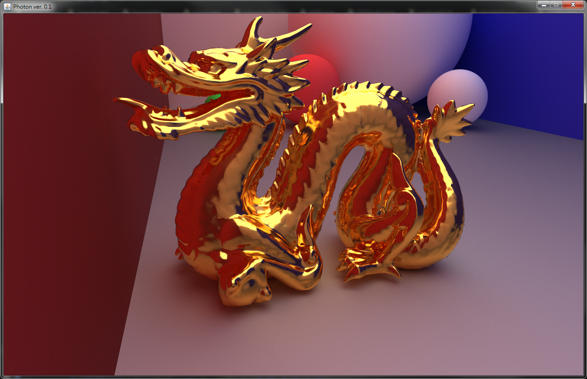
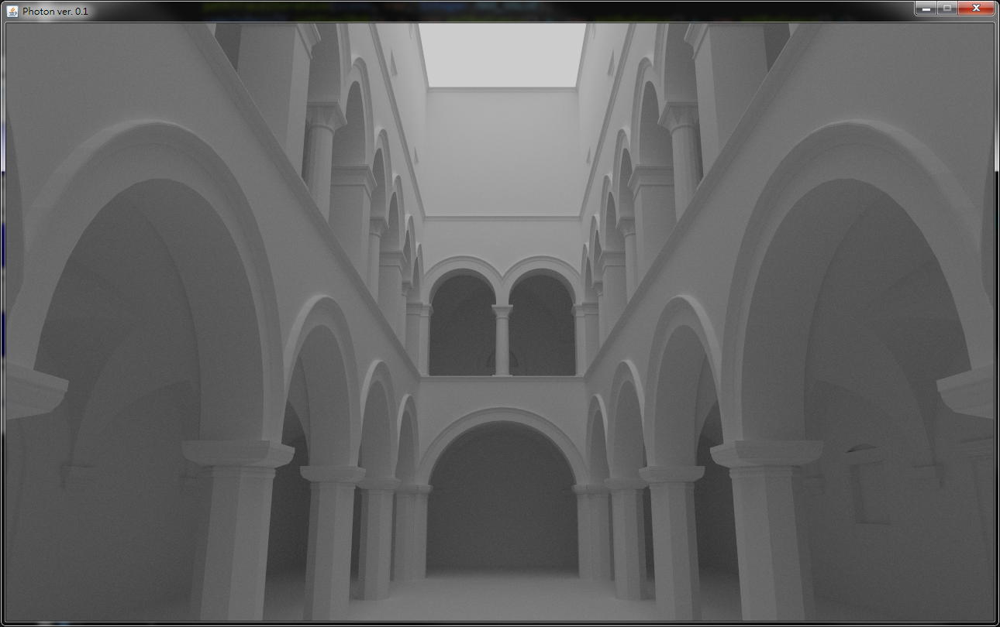
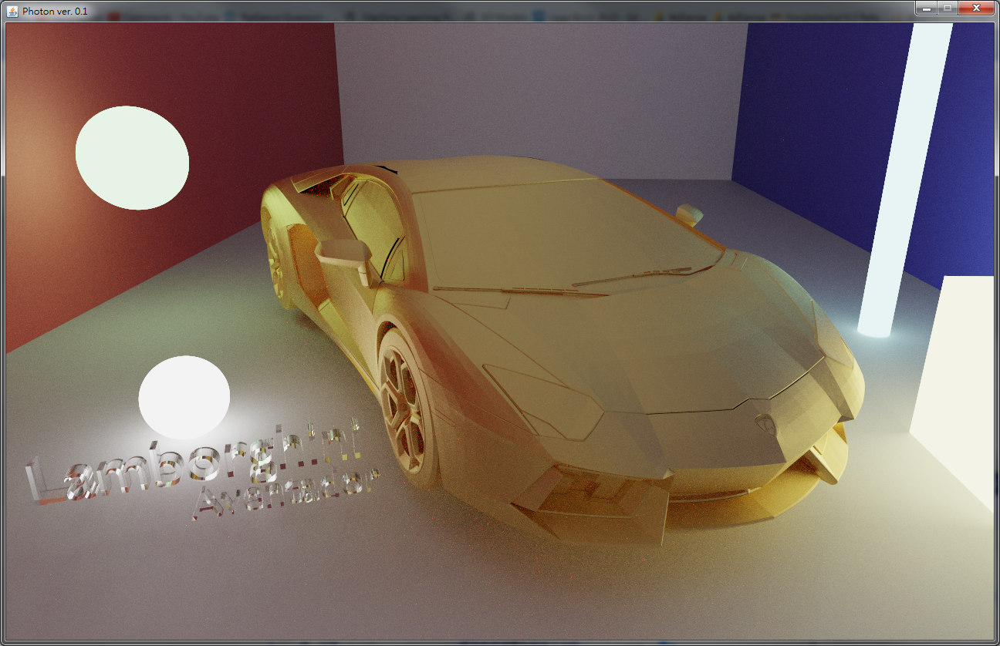
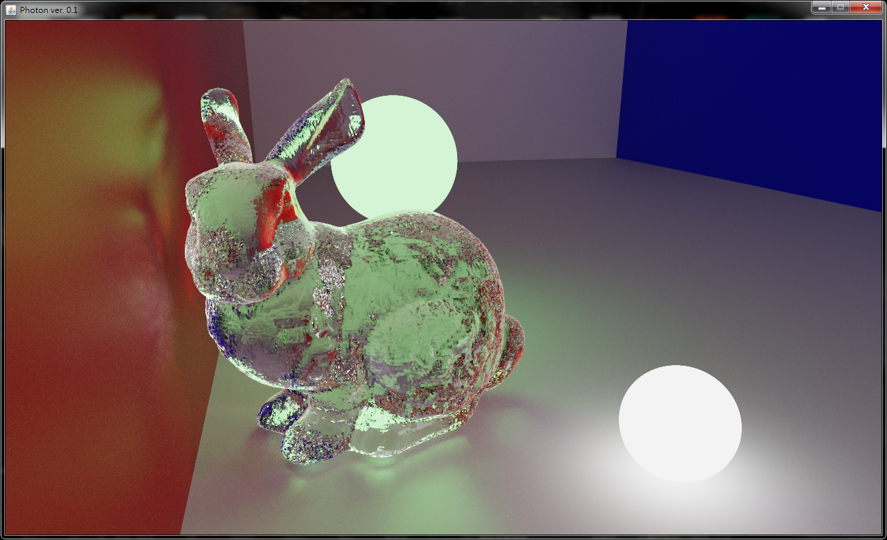

# What is Photon?
Photon is a simple Monte-Carlo path tracer made out of my personal interest in computer graphics. I read many brilliant ideas and concepts from a group of awesome people on the Internet and tried to implement some of them in my free time. Also, the development is still in progress and I am learning from it ([Photon-v2](https://github.com/TzuChieh/Photon-v2/) is the current version). Last but not least, I hope that I can improve the rendering quality of Photon more and more and eventually discover the secrets of the Universe...  

# Images Rendered by Photon
  
  
  
  

# About the Author
Facebook Page: https://www.facebook.com/tokzin3d/  
YouTube Channel: https://www.youtube.com/channel/UCKdlogjqjuFsuv06wajp-2g  
E-mail: r05922176@ntu.edu.tw  

If you have any questions or ideas about my project, feel free to send me an e-mail (=  
